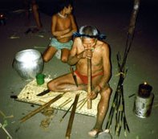

===================================================
Archives du Centre de Recherche en Ethnomusicologie
===================================================

Le Centre de Recherche en Ethnomusicologie fait partie du Laboratoire d'Ethnologie et de Sociologie Comparative (UMR 7186). Il se consacre à l'étude des pratiques et des savoirs musicaux, conçus autant comme processus de différentiation socio-culturelle que comme forme d'expression commune à l'Homme.

Cette approche, fondée sur un recueil raisonné des données musicales et un travail simultané d'enquête ethnographique, s'inscrit dans une anthropologie du fait musical envisagé dans ses dimensions socio-culturelles, esthétiques, formelles, acoustiques, kinésiques et finalement cognitives.

Le Centre investit par ailleurs de nouveaux objets encore peu explorés de la discipline comme le geste musical et chorégraphique, la construction culturelle et cognitive de l'émotion, ou encore les représentations du sonore. Les thématiques développées par les chercheurs, soit individuellement, soit dans le cadre de groupes de recherche, sont régulièrement exposées dans le cadre d'un séminaire interne.

Le CREM gère un vaste fonds documentaire (archives musicales et livres) de la plus haute valeur patrimoniale et consulté par un public international. Il est éditeur d'une importante collection de disques.

