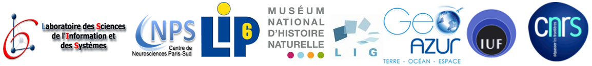

==============================================
SABIOD - Scaled Acoustic BIODiversity platform
==============================================
Bioacoustic signaling is a primary mode of communication and exploration for most of the animals. It enables quick load and transfer of information without any visible contact with the target, tackling the reduced visibility of deep forest (insect, frogs, birds, mammals...), cave or night activities (insects, bats), and/or the long distances like in ocean (krill, fishes, whales...).
Bioacoustics is also one of the factors in optimizing natural selection, playing a significant role in signalling resource qualities to potential partners.

The SABIOD project aims to detect, cluster, classify and index bioacoustic big data in various ecosystems, at different space and time scales, in order to reveal informations on the complex sensori-motor loop, and on the health of an ecosystem, yielding to new biodiversity insights.

**Keywords** : Acoustics, Signal Analysis, Machine Learning

.. image:: home_img.jpg
    :align: left

NEWS
====
* `Internatinal Workshop on Neural Information Scaled to Bioacoustics (joint to NIPS 2013) <http://sabiod.univ-tln.fr/nips4b>`_ 10th dec - deadline ext. abstract 13th oct.
* `IEEE ATSIP'14 last CFP - Special session on Bioacoustics Int. conf. on Ad. Tech. for Signal & Image Processing <http://sabiod.univ-tln.fr/ATSIP4B>`_

The Telemeta Platform
=====================
       
The collaborative platform `Telemeta <http://telemeta.org>`_ aims to make sound archives available to researchers and to the extent possible, the public, in compliance with the intellectual and moral rights of collectors. Developed with the support of the program `TGE-Adonis <http://www.tge-adonis.fr/>`_ of the `CNRS <http://www.cnrs.fr/>`_, allows researchers to exchange data online with communities, including through collaborative tools like markers , spaces, comments, etc...

CREDITS
=======
SABIOD is a `CNRS Big Data Interdisciplinary project <http://www.cnrs.fr/mi/spip.php?article53>`_ 2012-2014

**Laboratories** :  `LSIS <http://www.lsis.org/>`_, `LIP6 <http://www.lip6.fr/>`_, `CNPS <http://www.cnps.u-psud.fr/>`_, `MNHN <http://www.mnhn.fr/>`_, `LIG <http://www.liglab.fr/>`_, `Géoazur <https://geoazur.oca.eu/>`_

	

